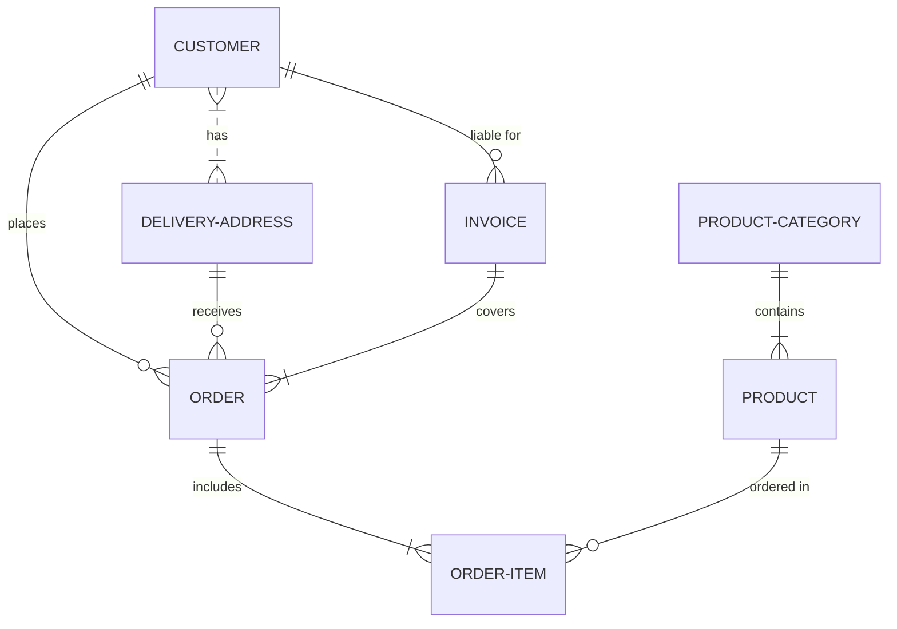

# 숙제 해야하는 거 
---

학생들 수업 자료 공유 

Fetch 실습


1. 여러 문서 작성 


```{mermaid}
sequenceDiagram
    participant Alice
    participant Bob
    Alice->>John: Hello John, how are you?
    loop HealthCheck
        John->>John: Fight against hypochondria
    end
    Note right of John: Rational thoughts <br/>prevail!
    John-->>Alice: Great!
    John->>Bob: How about you?
    Bob-->>John: Jolly good!
```


